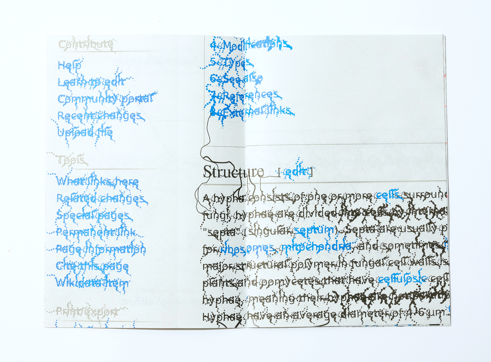
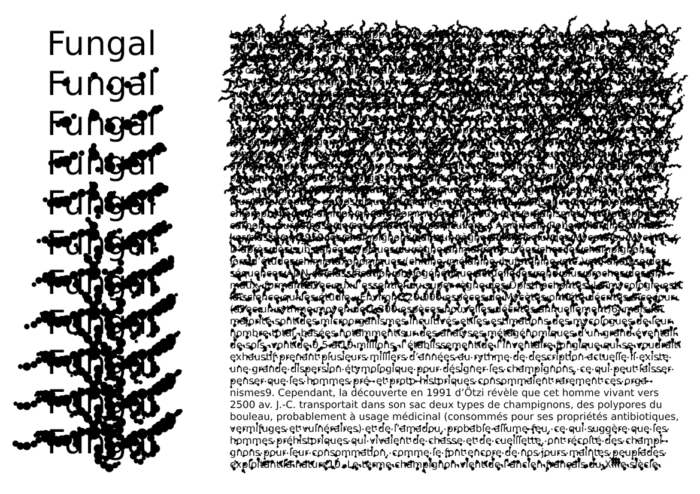
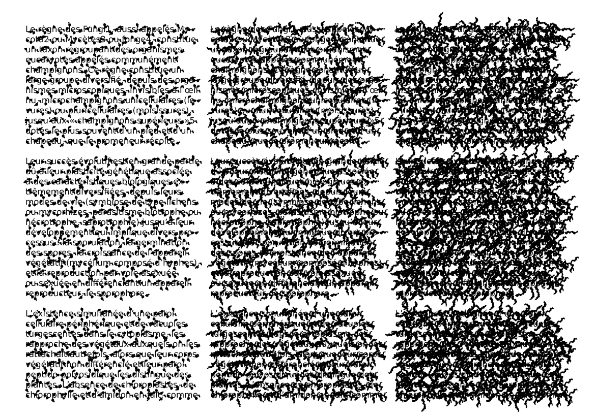
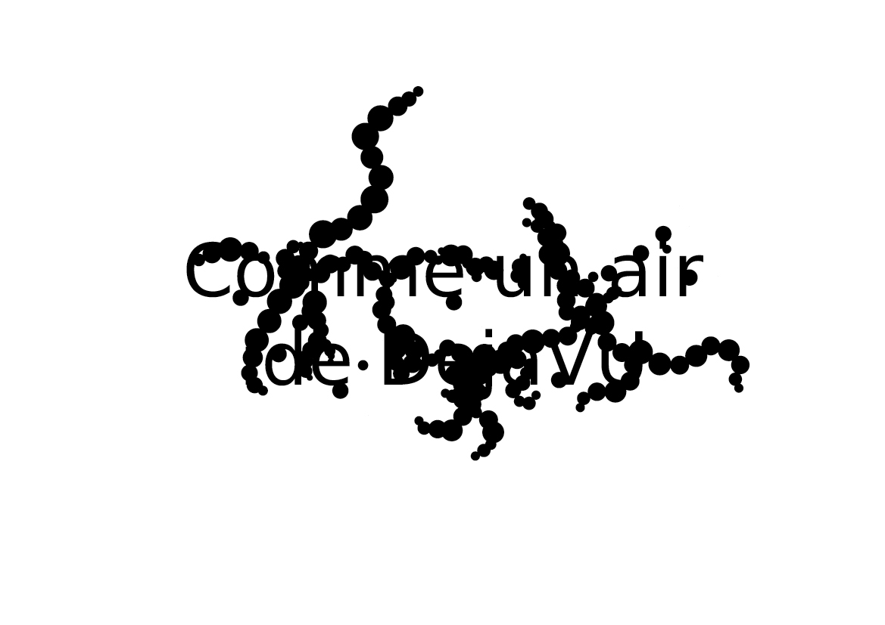
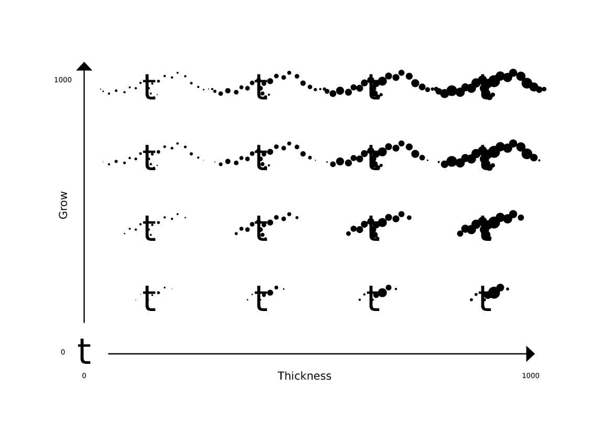

# Fungal

Libre variable font inspired by mycelium growth, forked from [DejaVu Sans](https://github.com/dejavu-fonts/dejavu-fonts/).

## Context

In 2022, Hato press invited Raphaël Bastide to do a publication part of the zine series. In a wish to revive the “fan” part of fanzine, Raphaël Bastide decided to pay tribute to Wikipedia, a surviving, precious, unequaled place on the open WWW. The 16 pages riso print zine shows the encyclopedia’s interface as a post-human vestige, an artifact invaded by biomorphic figures and spreading typography. Through the pages of the zine, the reader discovers how the graphic elements are spreading like mycelium, creating an ornamental graphic network.

The Fungal font is a close collaboration between [Jérémy Landes](https://studiotriple.fr/) and [Raphaël Bastide](https://raphaelbastide.com), so the characters of the zine can grow and spread thanks to their variable design. Fungal is a fork of DejaVu Sans, a libre font, popular on Linux systems.

The hypæ of the mycelium growing from each glyphs can be controlled in their length (the Grow axis) and in their thickness (the Thickness axis) allowing to fine tune the density of the rhizome growing on the page and the legibility of the text in the same move.

## Specimens

Visit the web specimen at [fungal.page](https://fungal.page/)

## Contributors

- [Raphaël Bastide](https://raphaelbastide.com)
- [Jérémy Landes](https://studiotriple.fr)

## License

Fungal is under [Bitstream Vera Fonts Copyright](http://dejavu.sourceforge.net/wiki/index.php/License)

## Repository Layout

This font repository structure is inspired by [Unified Font Repository v0.3](https://github.com/unified-font-repository/Unified-Font-Repository).
